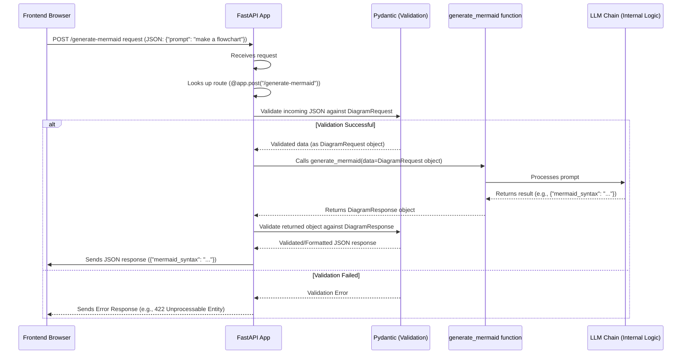

## How Data Flows with Models

Let's revisit the flow from Chapter 1, now including the data model validation steps:

As you can see, Pydantic validation happens automatically thanks to FastAPI integrating with it. This ensures only correctly formatted data makes it to your core logic and that your responses follow a defined structure.

## Other Data Models in Our Project

Our project uses other models for different types of requests:

| Model Name       | Used In Endpoint   | Purpose                                       | Structure Expectation                                   |
| :--------------- | :----------------- | :-------------------------------------------- | :------------------------------------------------------ |
| `QuestionData`   | `/ask-ai`          | Receiving a text question from the frontend.  | Expects a field `question` which is a string.           |
| `ImageData`      | `/calculate`       | Receiving an image (as base64) and variables. | Expects a field `image` (string, base64 data) and `dict_of_vars` (a dictionary). |
| `AnswerData`     | `/ask-ai`          | Sending back the AI's text answer.            | Expects a field `result` which is a string.             |
